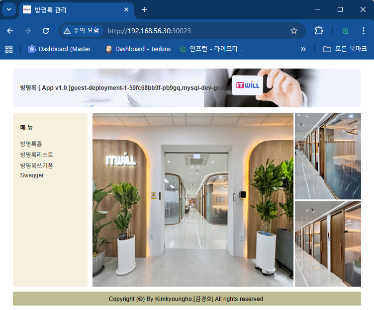
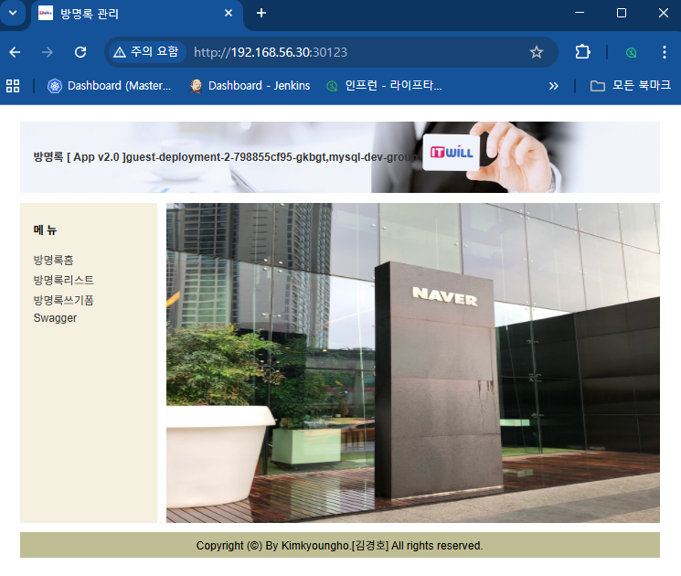

```bash
# blue 배포확인 
[root@k8s-master ~]#  while true; do curl http://192.168.56.30:30023/version; sleep 1; done;

[App Version] : App v1.0
[App Version] : App v1.0
[App Version] : App v1.0
[App Version] : App v1.0
[App Version] : App v1.0
[App Version] : App v1.0
[App Version] : App v1.0
...
```

# NodePort 30023
  - [부라우져]  http://192.168.56.32:30023 

   >


```bash
# green 배포확인 
[root@k8s-master ~]#   while true; do curl http://192.168.56.30:30123/version; sleep 1; done;
[App Version] : App v2.0
[App Version] : App v2.0
[App Version] : App v2.0
[App Version] : App v2.0
[App Version] : App v2.0
...

```

# NodePort 30023
  - [부라우져]  http://192.168.56.32:30123 

   >